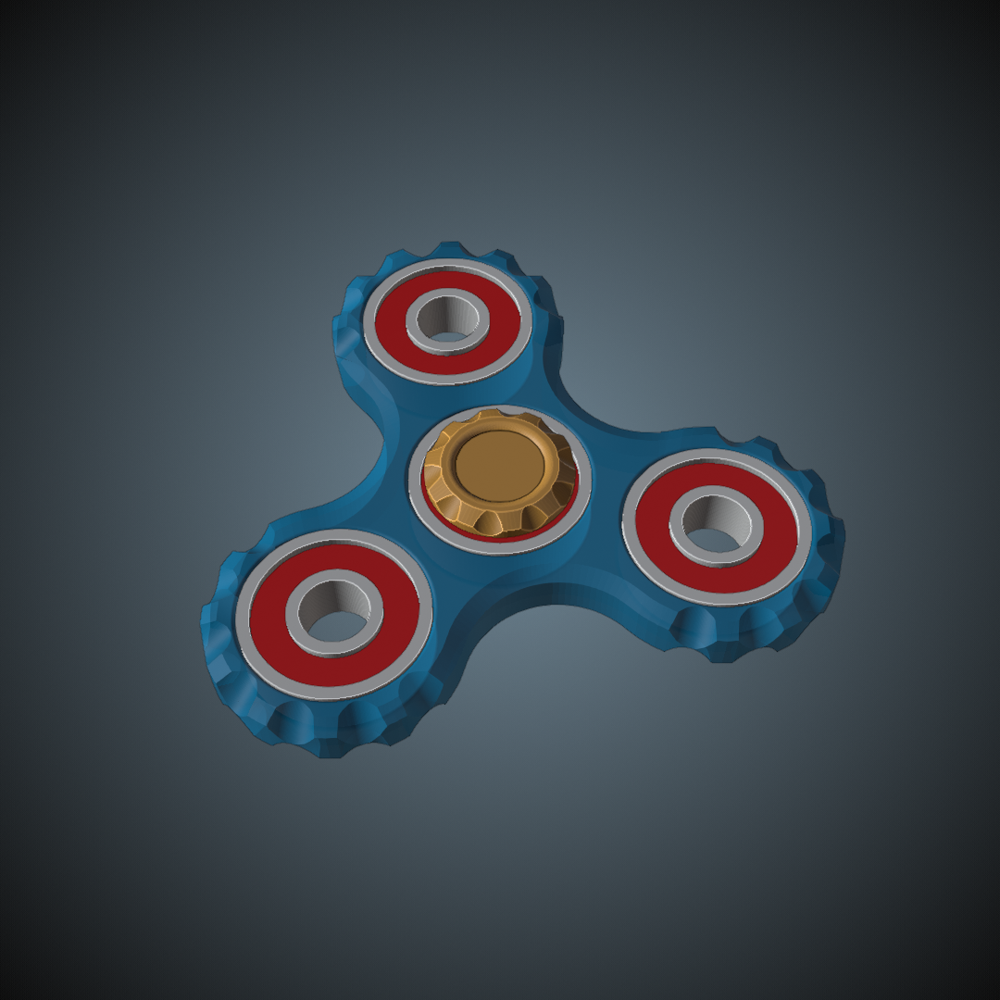

# fidget-spinner

Download from Printables here: [`Download Link`](https://www.printables.com/@EvokeMadness_492935)

### Summary

A fidget spinner with a satisfying divot shape around each weight.

This model is an updated version of one of my first CAD models and 3D prints.

### Print Settings

Print the fidget spinner flat on the print bed.

### Bill of Materials

- Four 608 skateboard bearings
- Permanent adhesive

### Assembly

- Coat the outside circumference of each bearing with glue, and slide each bearing into one of the four holes on the main body.

### Notes

- The fidget spinner handles are a work in progress, and may have fitment issues.

### Optional

- You may be able to replace the bearings used as weights with something different, so I've included a 3MF file with customizable negative volume cylinders.

### A note from the designer

I printed mine with translucent TPU. The TPU helped with the fitment, and I liked the atomic blue look on the fidget spinner. I hope this toy brings you joy, and if you've made your own I'd like to see it.

## Preview

